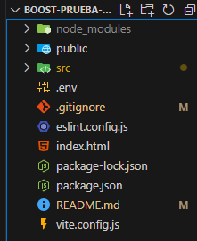

# BOOST CAR APP
Puedes ingresar directamente a observar la aplicacion presionando [aqui](https://boost-prueba.vercel.app/) o localmente siguiendo el tutorial de abajo

## Requisitos Previos

Asegúrate de tener [Node.js](https://nodejs.org/) instalado en tu máquina. Puedes verificarlo ejecutando:

```bash
node -v
````

## Configuracion del proyecto

### 1. Clona el repositorio 
En tu pc clonar el repositorio utilizando la terminal integrada o misma la de git utilizando el siguiente codigo

```
git clone https://github.com/maurojjzz/boost-prueba.git
```

### 2. Instalar dependencias

Ya teniendo clonado el repositorio ingresar a la carpeta raiz del proyecto con el siguiente comando 
```
cd boost-prueba-tecnica
```
Luego de realizar esto, en la misma terminal ejecutaremos el siguiente comando el cual instalara todas las dependencias necesarias para ejecutar correctamente la aplicacion

```
npm install
```
### 3. Creacion variables de entorno
Ejecutamos el siguiente comando en la terminal una vez que se haya terminado de instalar las dependencias para ingresar al visual studio 
```
code .
```
Luego alli en la raiz del proyecto creamos un archivo nuevo el cual lo llamaremos **.env**


Clickeamos en ese archivo y dentro de el pegamos la siguiente linea de codigo
```
VITE_API_URL=https://66d8d7224ad2f6b8ed52cbb4.mockapi.io/boost
```
y guardamos el archivo (**ctrl + s** o desde visual studio -> **archivo -> guardar** )

### 4. Iniciar la aplicacion
Volvemos a la terminal y corrobore estar ubicado en la raiz del proyecto para ejecutar el siguiente codigo
```
npm run dev
```

Y la aplicacion estara disponible en [http://localhost:5173/](http://localhost:5173/)